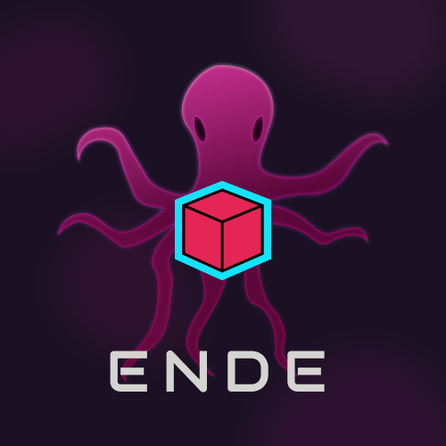

# 🌀 Ende - A 3D Procedural Generator

---

## 🌍 Overview

**Ende** is a real-time system for generating 3D geometry—currently focused on **terrain** and **rocks**—using procedural algorithms. It supports various noise functions and real-time editing with full customization via an intuitive UI. Perfect for **game development**, **simulation**, and **generative art** projects.

## ✨ Features

- 🌄 **Procedural Terrain** generation
- 🧱 **Procedural Rocks** with noise-based variation
- 🎛️ **Customizable generation** via UI
- ⚙️ Support for:
    - Sine/Cosine patterning
    - Fractal Noise
    - Value Noise
    - Perlin Noise
- ⚡ **Real-time Editing** with immediate feedback

## 🚀 Installation

1. Download release
2. Unzip
3. Go to endeapp directory
4. Double-click the binary/executable

> ⚠️ **Important:** Do not move the binary/executable after unizipping
> as it will break the path!